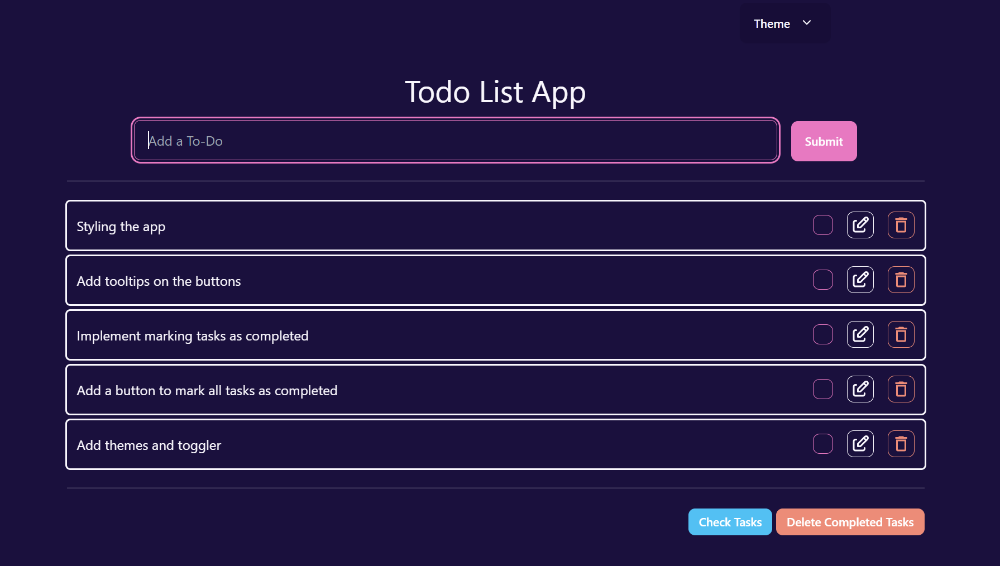
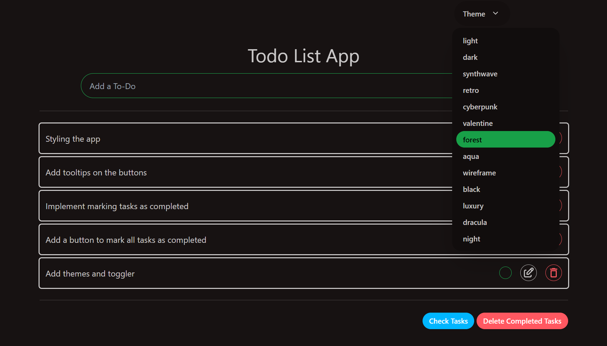

# A To-Do App built with Svelte

This is a simple to-do app built using Svelte.

- Simple and Elegant



- Multiple themes



## Features

- [x] Add a task to a list
- [x] Edit a task
- [x] Delete a task
- [x] Mark a task/tasks as completed
- [x] Delete completed tasks at once
- [ ] Perstistance of tasks

## Getting Started

To get a local copy up and running follow these simple example steps.

### Prerequisites

- Node.js
- npm

### Setup

- Clone the repository

```bash
git clone https://github.com/ZendaInnocent/svelte-todo-app.git

```

- Change to the directory

```bash
cd svelte-todo-app
```

- Run `npm install` to install all the dependencies
- Run `npm run dev` to start the development server

## Authors

👤 **Innocent Zenda**

- Github: [@ZendaInnocent](https://github.com/ZendaInnocent)

## 🤝 Contributing

Contributions, issues and feature requests are welcome!

## Show your support

Give a ⭐️ if you like this project!

## Acknowledgments

- [Svelte Interactive Tutorial](https://learn.svelte.dev/tutorial/welcome-to-svelte)

## 📝 License

This project is [MIT](./LICENSE) licensed.
